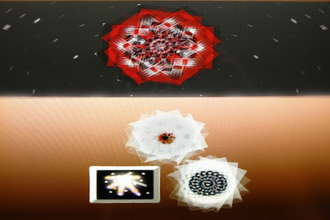
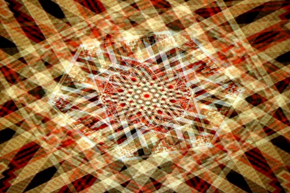

# Magic Carpet

A generative audiovisual artwork that produces imagery using rapidly spinning photos of rugs and quilts.  Video documentation is [here](https://www.youtube.com/watch?v=vnxtZg9wPo4).

Magic Carpet is written in cross-platform C++ using SDL with minimal dependencies.  It currently builds for Raspberry Pi and iOS, and I'm planning to add builds for other platforms.  This code was ported from my original Magic Carpet iOS Objective C app. 

In addition to making Magic Carpet carpet more portable, I intended the project to be a skeleton for creating other lightweight cross-platform audiovisual C++ applications.  It includes a very simple sprite system that can load images from JPEGs, an audio engine that can load Ogg files into buffers and play samples from them, plus it includes examples of reading touch and keyboard input.

(c) 2011-2018 Paul Slocum all rights reserved.  I plan to soon release this code soon under MIT license.  Contact me if you'd like to use it.  

